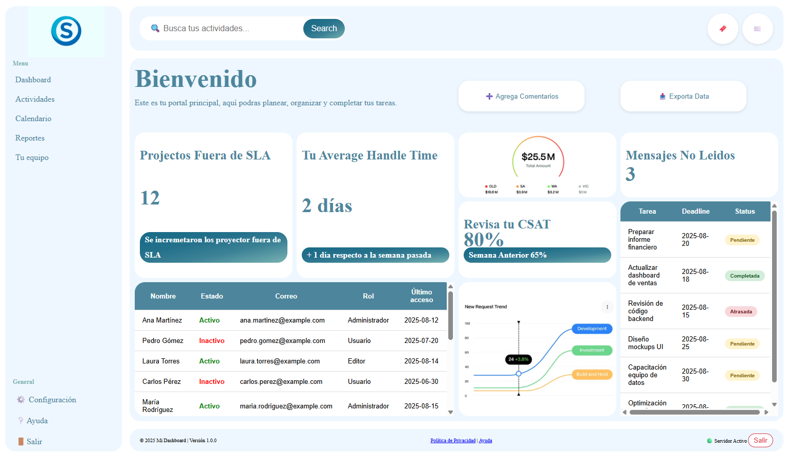
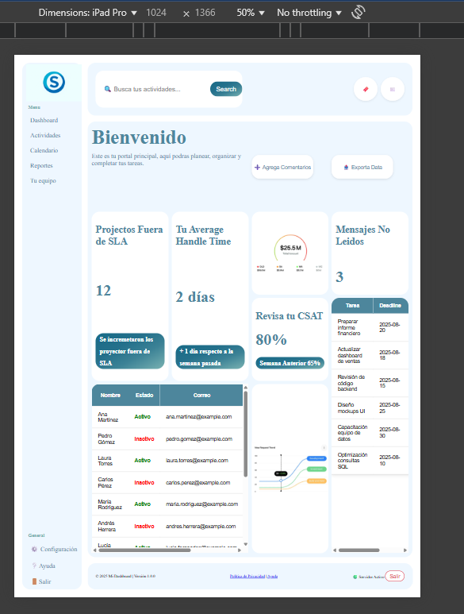
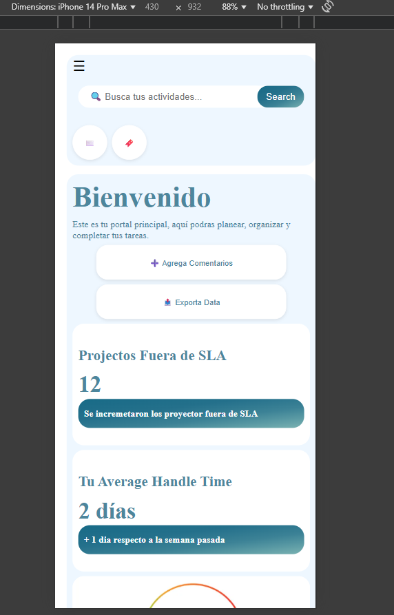

# 📊 Dashboard

## 📌 Descripción  
Este proyecto es un **dashboard interactivo y responsive** que permite visualizar actividades, métricas de desempeño y tablas de información en un solo lugar.  
Su diseño está pensado para ser **limpio, organizado y adaptable** a cualquier dispositivo (PC, tablet o móvil).  

Incluye:  
- Panel de navegación lateral con menús.  
- Tarjetas con métricas clave.  
- Tablas con información dinámica.  
- Encabezado con búsqueda y accesos rápidos.  
- Pie de página con estado del servidor.  

---

## 🛠️ Tecnologías usadas  
- **HTML5** → estructura semántica con roles ARIA para accesibilidad.  
- **CSS3 (Grid & Flexbox)** → diseño responsive adaptado a escritorio, tablet y móvil.  
- **JavaScript** → interacción del menú lateral (abrir/cerrar en móviles).  
- **Variables CSS (custom properties)** → manejo centralizado de colores, degradados y estilos.  

---

## 📱 Capturas de pantalla  

### 🖥️ Escritorio

### 📒 Tablet

### 📱 Móvil

---

## 🎨 Decisiones de diseño y accesibilidad  
- **Diseño en tarjetas** para resaltar métricas clave de forma rápida.  
- **Menú lateral fijo en escritorio** y **oculto/desplegable en móviles**, mejorando la usabilidad en pantallas pequeñas.  
- **Uso de ARIA roles** (`role="navigation"`, `role="main"`, `role="contentinfo"`, etc.) para mejorar la compatibilidad con lectores de pantalla.  
- **Colores con contraste alto** definidos en variables CSS, facilitando cambios de tema y manteniendo la consistencia visual.  
- **Animaciones sutiles** (hover y transiciones) para mejorar la experiencia sin distraer al usuario.  
- **Responsive first**: diseñado para adaptarse a resoluciones desde móviles hasta pantallas grandes.  
